# Scripting Assistant – For vMix

A strongly-typed development environment for writing VB.NET scripts compatible with [vMix](https://www.vmix.com/), built as a Visual Studio Code extension.

> **Disclaimer:** This is an unofficial community extension. It is not affiliated with, endorsed by, or supported by StudioCoast Pty Ltd. "vMix" is a registered trademark of StudioCoast Pty Ltd.

## ⚠️ Beta

This extension is currently in **beta**. If you encounter any issues — whether it's a bug, an incorrect function signature, missing parameters, or unexpected behavior — please [open an issue](https://github.com/sysprofile/scripting-assistant-for-vmix/issues) on this repository. Reports about specific vMix API functions (wrong parameter types, missing overloads, incorrect ranges) are especially valuable.

We are actively working on a community editing tool that will allow contributors to review and correct the function database directly.

**Supported vMix version:** 29

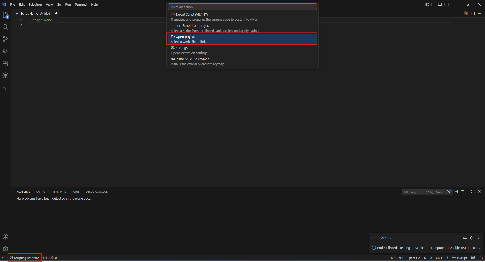
<!-- Screenshot: full editor showing a .vmixscript file with IntelliSense open, diagnostics visible, and the status bar icon -->

---

## Features

### Contextual IntelliSense

Full autocompletion for all functions in the vMix API, organized by category. The extension suggests parameters based on type, filters Inputs by compatibility, and shows valid value ranges inline.

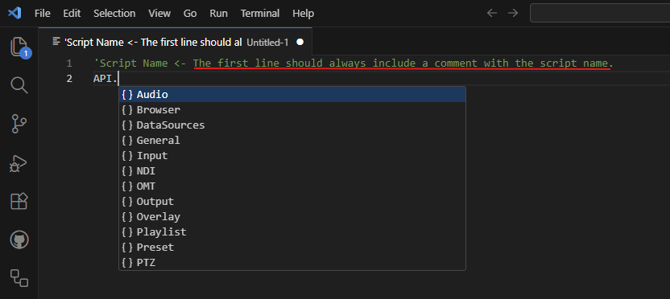
<!-- Screenshot: typing "API." showing the category list (Title, General, Audio, etc.) -->

#### SetText with two overloads (required-only vs all params)
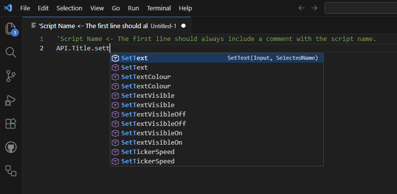
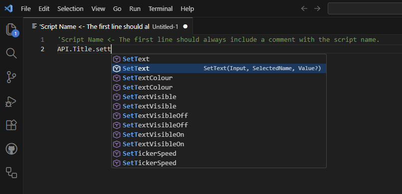

<!-- Screenshot: typing "API.Title." showing SetText with two overloads (required-only vs all params) -->

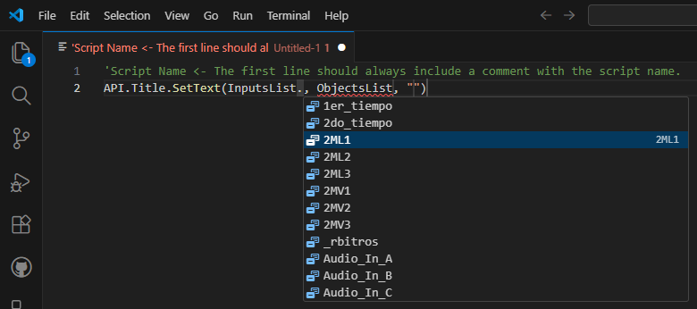
<!-- Screenshot: inside SetText() showing InputsList filtered to GT Title inputs only -->

### Smart Object Filtering

When a project is linked, the extension reads `.gtzip` title files and populates `ObjectsList` with TextBlock and Image elements. Objects are filtered by parent input and by kind — `SetText` only shows text objects, `SetImage` only shows image objects.

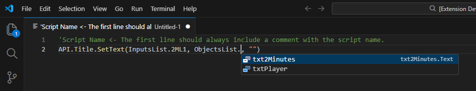
<!-- Screenshot: typing ObjectsList. inside SetText showing only text objects from the selected input -->

### Real-Time Diagnostics

Catches errors as you type: invalid parameter types, out-of-range values, missing required arguments, and structural issues like `Sub`/`Function` declarations (which vMix does not allow).

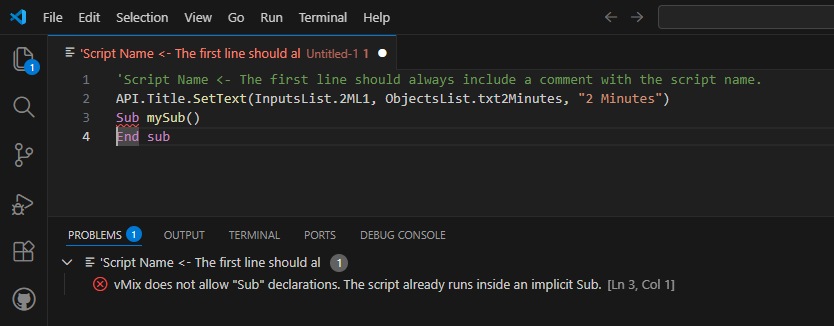
<!-- Screenshot: editor showing red/yellow squiggles with error messages in the Problems panel -->

### Signature Help

Displays the full function signature with parameter names, types, and valid ranges while typing inside parentheses.

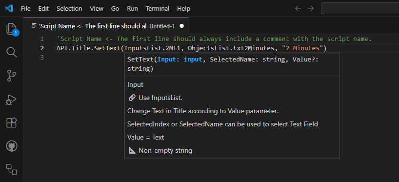
<!-- Screenshot: signature popup showing parameter info with range like "Value: 0–100" -->

### Bidirectional Transpiler

Write in the typed syntax and export to native VB.NET that vMix understands. Import existing scripts from a linked project and they are automatically converted to the typed format.

**Typed syntax (what you write):**

```vb
'My Score Script
Dim score As String = "3"
API.Title.SetText(InputsList.Score_vMix, ObjectsList.txtHome, score)
API.Title.SetText(InputsList.Score_vMix, ObjectsList.txtAway, "1")
```

**Native VB.NET (what vMix receives after export):**

```vb
'My Score Script
Dim score As String = "3"
API.Function("SetText", Input:="Score vMix", SelectedName:="txtHome.Text", Value:=score)
API.Function("SetText", Input:="Score vMix", SelectedName:="txtAway.Text", Value:="1")
```

### Project Integration

Link a `.vmix` project file and the extension automatically reads all Inputs and GT Title objects. Changes to the project are detected and reloaded.

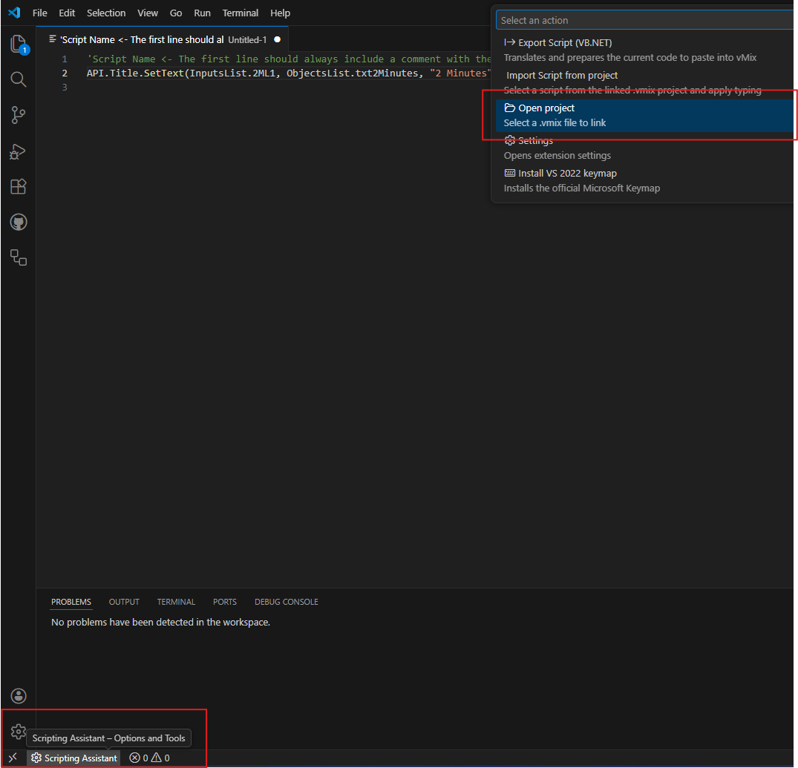
<!-- Screenshot: file picker dialog selecting a .vmix file -->

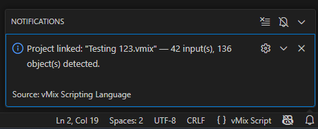
<!-- Screenshot: notification showing "Project linked: MyShow.vmix — 12 input(s), 28 object(s) detected" -->

### Import & Export

**Export:** Converts the current `.vmixscript` file to native VB.NET and opens it in a new tab, ready to paste into vMix. Optionally updates the script directly in the linked project (with automatic backup).

**Import:** Lists all scripts in the linked project. Select one and the transpiler converts native `API.Function()` calls back to the typed format with `InputsList` and `ObjectsList` references.

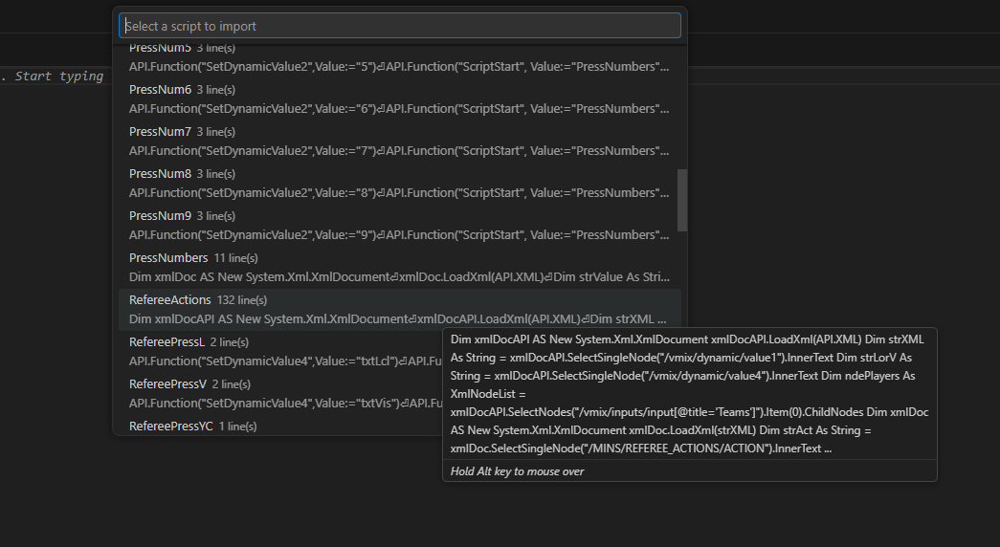
<!-- Screenshot: QuickPick showing available scripts from the project with line counts -->

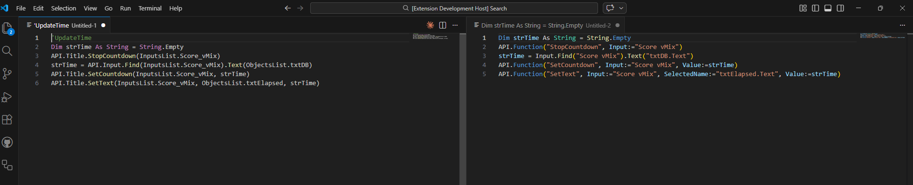
<!-- Screenshot: side-by-side of typed script and exported native VB.NET -->

### Additional Features

- **Auto-closing blocks:** Press Enter after `If`, `For`, `While`, `Do`, or `Select Case` and the extension generates the closing block with cursor positioned inside.
- **Automatic casing correction:** Keywords, API functions, and variables are corrected to proper casing in real time.
- **DataSource support:** First-class autocompletion for DataSource types (GoogleSheets, Excel/CSV, RSS, XML, JSON, etc.) in data-related functions.
- **Internationalization:** Full UI in English and Spanish, detected automatically from VS Code language settings.

---

## Getting Started

### 1. Install the Extension

Clone this repository and open it in VS Code:

```bash
git clone https://github.com/sysprofile/scripting-assistant-for-vmix.git
cd scripting-assistant-for-vmix
npm install
npm run compile
```

Then press `F5` to launch the Extension Development Host.

### 2. Link a Project

Open the Command Palette (`Ctrl+Shift+P`) and run:

```
Scripting Assistant: Open project...
```

Select your `.vmix` project file. The extension reads all Inputs and extracts objects from GT Title (`.gtzip`) files.

### 3. Create a Script

Create a new file with the `.vmixscript` extension. The first line must be a comment with the script name:

```
'My Script Name
```

Start typing `API.` to see categories, then continue with the function name and parameters.

### 4. Export

When ready, open the Command Palette and run:

```
Scripting Assistant: Export Script (VB.NET)
```

The transpiled code opens in a new tab. Copy and paste it into vMix, or let the extension update the project file directly.

---

## Typed Syntax Reference

| Typed Syntax | Native vMix Equivalent |
|---|---|
| `API.Title.SetText(InputsList.MyTitle, ObjectsList.txtName, "Hello")` | `API.Function("SetText", Input:="MyTitle", SelectedName:="txtName.Text", Value:="Hello")` |
| `API.General.Cut()` | `API.Function("Cut")` |
| `API.Audio.SetVolume(InputsList.Music, 80)` | `API.Function("SetVolume", Input:="Music", Value:="80")` |
| `API.Input.Find("Camera 1")` | Variable reference to an Input |

---

## Requirements

- Visual Studio Code 1.80+
- A vMix installation with `.vmix` project files (for project integration features)

---

## API Sources

The function database was built from the following references:

| Source | Version | URL |
|---|---|---|
| vmix-function-list by Jens Stigaard | Up to v27 | [github.com/jensstigaard/vmix-function-list](https://github.com/jensstigaard/vmix-function-list) |
| Unofficial vMix API Reference | Up to v29 | [vmixapi.com/](https://vmixapi.com/) |
| vMix Shortcut Function Reference | v29 | [vmix.com/help29/ShortcutFunctionReference.html](https://www.vmix.com/help29/ShortcutFunctionReference.html) |

---

## License

MIT

---

## Acknowledgments

Built for the vMix community. vMix is a registered trademark of [StudioCoast Pty Ltd](https://www.studiocoast.com.au/).